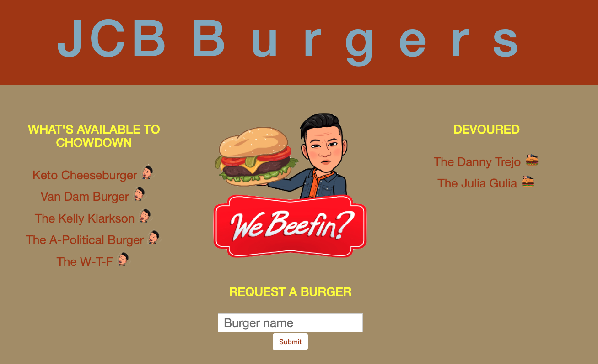

# Burger
HEROKU: https://jcbburgers.herokuapp.com/

A burger logger web application that uses MySQL, Node, Express, Handlebars, and a homemade ORM. It follows the MVC design pattern, uses Node and MySQL to query and route data in the app, and uses Handlebars to generate the HTML.

### How It Works
* Burger is a restaurant app that lets users input the names of burgers they'd like to eat.
* Whenever a user submits a burger's name, the app will display the burger on the left side of the page--waiting to be consumed.
* Each burger in the waiting area also has a button to eat it. When the user clicks it, the burger will move to the right side of the page.
* Burgers on the right side of the page have a delete button to remove it from view.
* The app stores every burger in a database, whether eaten or not.

### Technologies Used
HTML, CSS, JavaScript, jQuery, MySQL, Node.js, Express.js, Handlebars, ORM, MVC

### Description & Requirements

HOME PAGE Screen Shot

### Notes
I would like to thank Google and generous coders who helped me complete this project.  
